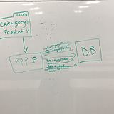

# LAB - 08

## Data Modeling Mongodb

### Author: Jeremy Lee

### Links and Resources
* [submission PR](http://xyz.com)
* [travis](http://xyz.com)

### Setup
#### `.env` requirements
* `PORT` - Port Number
* `MONGODB_URI` - URL to the running mongo instance/db

#### Running the app
* `npm start`
* Endpoint: `/foo/bar/`
  * Returns a JSON object with abc in it.
* Endpoint: `/bing/zing/`
  * Returns a JSON object with xyz in it.
  
#### Tests
* How do you run tests?
* `npm test`

#### UML

